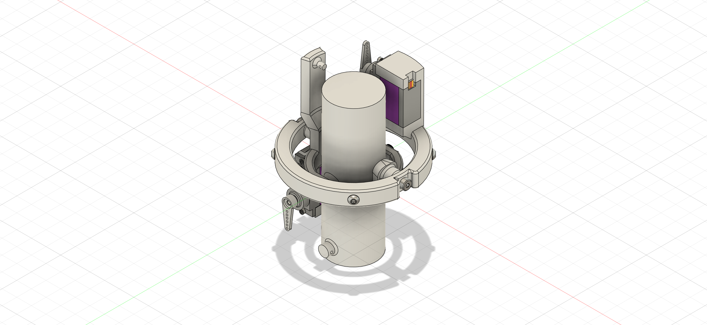
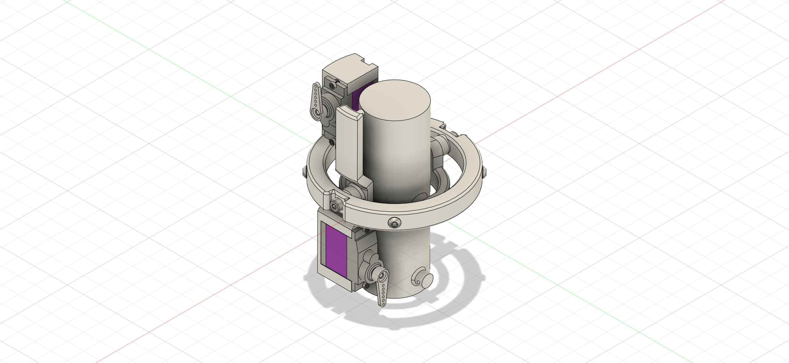
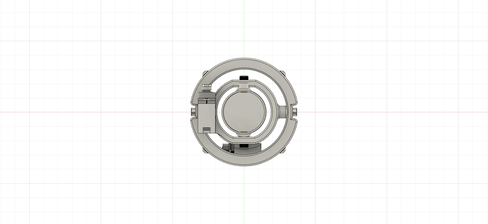
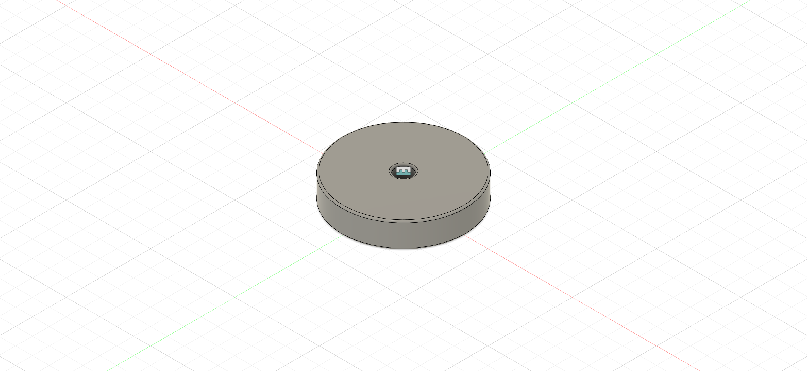
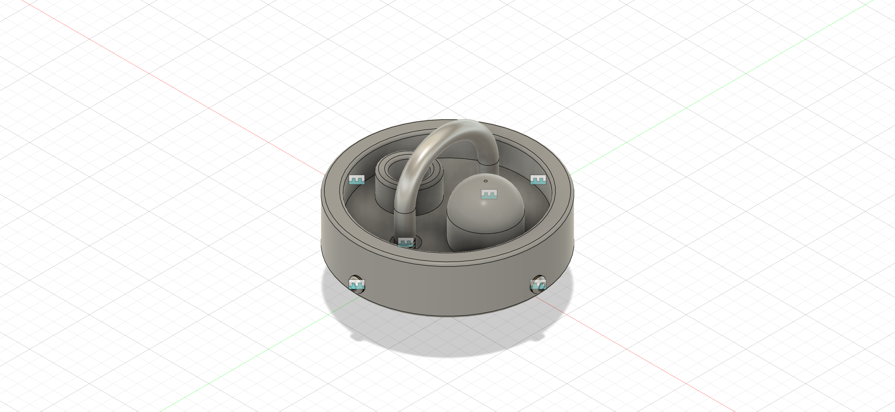
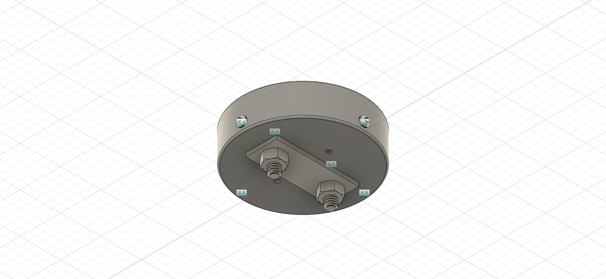
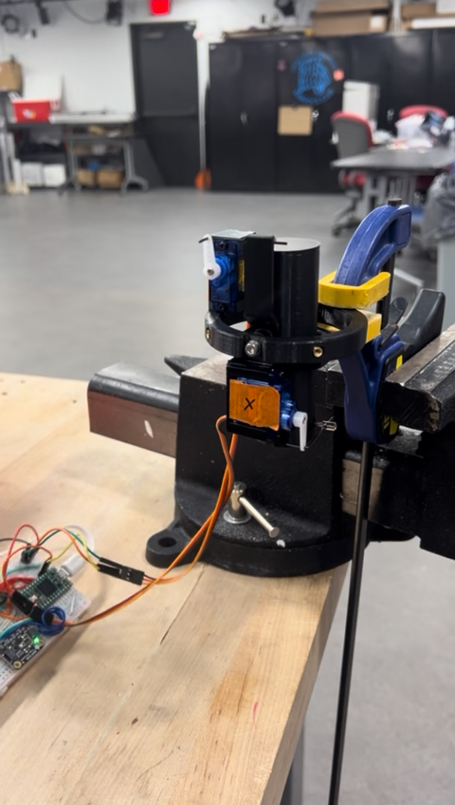
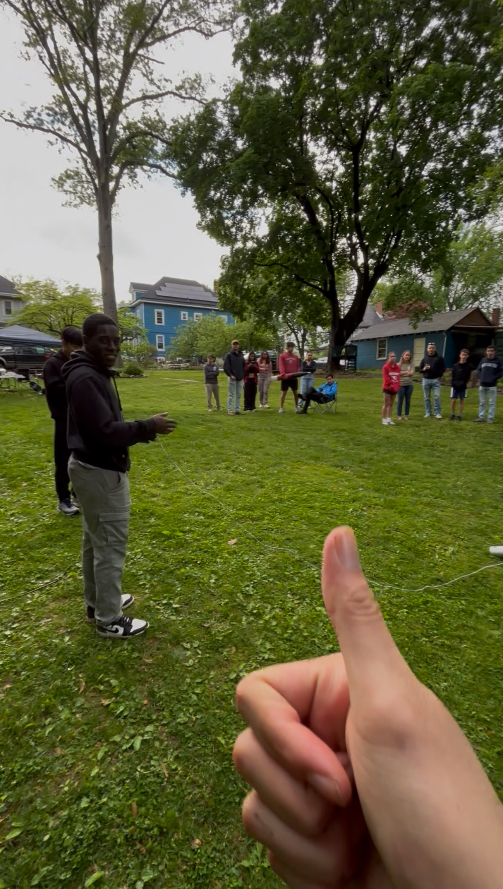

# Princeton Rocketry – Active Controls (Thrust Vector Control)

## Overview
This project is part of the **Princeton Rocketry Club’s Active Controls subteam**, where we design, build, and test a thrust vector control (TVC) system for high-power model rockets. The TVC allows the rocket to dynamically adjust its thrust direction during flight, improving stability and control.

*The CAD files for each of the three components I designed can be found in the [/CAD folder](CAD/) in the forms of .3mf files.*

## My Role
- **Team Lead (Jun 2025 – Present):**  
  - This year, I am in charge of organizing testing, an initial launch at the beginning of the year, refinement of our design, and a second launch of the TVC system at the end of the year.
  - I am implementing a structured cycle of goal-setting, planning, execution, and review to grow both the team and individuals.  
  - By personalizing each member's role to their strengths and goals, I aim to maximize both productivity and individual growth.
  - Taking on the lead role means getting out of my comfort zone and becoming comfortable with PCB design, control systems, and more, which I have been doing over the summer and plan to continue to do.

- **Mechanical Team Member (Aug 2024 – May 2025):**  
  - Modeling the Thrust Vector Control motor mount in Fusion 360 using previous iterations as references, I was able to cut down its footprint by around 20% while maintaining the desired ranges of motion.
  - The parachute ejection system was designed from scratch with references to popular online rocketry creators (like BPS Space). It began as a [hand drawn design](sketches/bulkheads_sketch), which guided the CAD modeling design and prototype testing.
  - Communication with electrical and software teams was crucial to make sure deadlines were met and the TVC/parachute system integrated seamlessly.

## Technical Highlights
- **CAD & Design Tools:** SolidWorks, Fusion360, KiCad
- **Fabrication:** 3D printing, heat-set inserts, precision assembly  
- **Integration:** Work with electronics and software for real-time control  
- **Testing:** Black powder testing of parachute ejection system, TVC response testing

## Future Work and Goals
- Complete first-semester launch with TVC system  
- Enhance control algorithms and system robustness with different components
- Program different pre-determined paths to maneuver (without tripping the ITAR wire)
- Explore BIGGER rocket ??? 
- Increase subteam visibility and recruit new members  

## Media
**📸 Thrust Vector Control Motor Mount**
Isometric Views

Bottom View

*Access the engineering drawing for the motor mount [here](drawings/motor_mount_drawing.pdf).*

**📸 Bulkheads from Parachute Ejection System**
Upper Bulkhead

Lower Bulkhead

*Access the engineering drawing for the Upper Bulkhead [here](drawings/upper_bulkhead_drawing.pdf) and the Lower Bulkhead [here](drawings/lower_bulkhead_drawing.pdf).*

**📹 Early-Stage TVC Actuation Test**

**📹 Parachute Ejection Test Video**

**📹 Live Fire Test Video**

*to be uploaded...*
